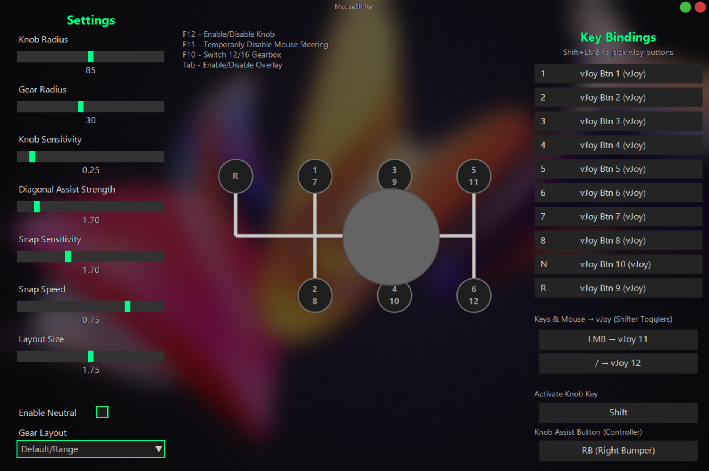
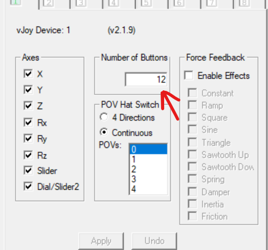
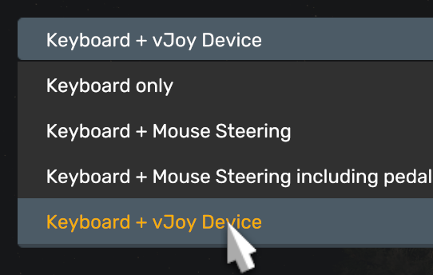
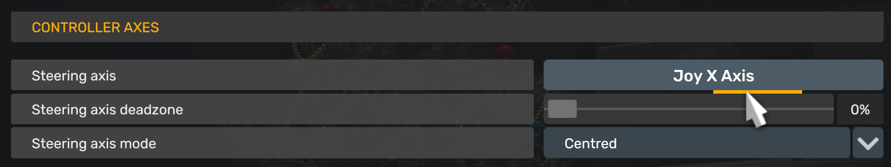
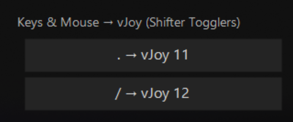
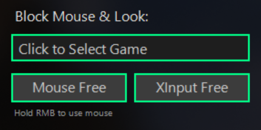

# 🕹️ MouseShifter

**MouseShifter** allows you to use your mouse as an H-pattern gear shifter in games, providing precise control and an engaging driving experience.

> It supports popular sim racing and driving games like *Euro Truck Simulator 2*, *American Truck Simulator*, *BeamNG.drive*, *Project CARS*, and more.

**⚠ Note:** This doesn’t disable mouse steering/looking — you can still use mouse steering/looking while using MouseShifter! It simply adds gear shifting functionality without interfering with your existing controls.

---

## ✨ Features

- 🎛️ **Mouse-Based H-Shifter**  
- 🗂️ **Customizable Gear Layouts**  
- ⚙️ **12/16 Gearbox Support**  
- 🎮 **Built-in vJoy Support**  
- 🕹️ **Experimental Controller Support**
- 🖱️ **Mouse-Look / XInput Blocking**
- 🛞 **Dual Mouse Control (Steering + Shifting)**
- 🎨 **Fully Customizable Controls and Layout**

---

---

## 🖥️ Requirements

- ✅ [vJoy driver](https://sourceforge.net/projects/vjoystick/) – This virtual joystick driver is necessary for input mapping.  
- ✅ [DS4Windows](https://github.com/ryochan7/ds4windows/releases) – An optional tool for PlayStation controllers to enable XInput support.

---

## ⚡ How to Use

1. Download the latest release from GitHub and extract the ZIP file.  

⚠️ IMPORTANT

- **Make sure you have at least 12 buttons set and all axes enabled in vJoy settings, must always be vJoy Device: 1**.

Start -> Search "Configure vJoy"

2. Run `MouseShifter.exe` as Administrator.  
3. Position the overlay window where you want it, then press **Tab**.  
4. Press **F12** to temporarily disable the knob.  
5. Launch your game.  
6. Open the control settings and bind your gear controls.  
  
7. Done — you’re ready to play!  

> ⚠️ **Tip:** If the overlay doesn’t appear or function properly, try setting your game to **borderless mode**.

---

📚 Guides: Euro Truck Simulator 2 & American Truck Simulator

  
Video Guide: https://www.youtube.com/watch?v=w5_lFoCMoK4
  
### ⚠️ Important
- **Before proceeding, create a backup of your `controls.sii` file**.  
- **Disable Steam Cloud**
- **Run MouseShifter as Admin**
- **Make sure you have atleast 12 buttons set and all axes enabled in vJoy settings, must always be vJoy Device: 1**.

  Start -> Search "Configure vJoy"
  

---

### 🚛 Using in Euro Truck Simulator 2 / American Truck Simulator

1. Make sure all gears are bound to vJoy buttons in the app (default bindings are included).
2. Open the app, then launch the game.  
3. Go to **Options → Controls**, and choose **Keyboard + vJoy Device** as the main device.  

4. Scroll to **H-Shifter** and map all gears and togglers.  

5. Shift gears with your mouse while holding **Right Click** to look around.
---

### 🖱 Using Mouse Steering

1. Enable **Mouse Steering** in the app.  
2. Choose **H-Shifter Mouse Device** and **Mouse Steering Device**.  
3. Within the game, go to **Options → Controls**, and:  
   - ❌ **Do not** enable Keyboard + Mouse Steering.  
4. Bind the steering axis, and optionally bind the acceleration or brake axes for mouse throttle or brake.

> ⚠️ **Warning:** Press **F11** to temporarily turn off mouse steering before pausing or accessing in-game menus.  
> ℹ️ **Tip:** If you want to use **dual mouse steering + H-Shifter**, see the [Dual Mouse Setup](#dual-mouse-setup) below.
---

### 🛞 Using Wheel or Pedals

1. In the game, go to **Options → Controls**.  
2. Keep **Keyboard + vJoy Device** selected as your primary device.  
3. Pick your **wheel or pedals** as an additional device.  
4. Bind the steering, throttle, brake, or clutch as needed.  
5. That’s it — you’re ready to drive!

---

### 🎮 Using Experimental Controller Support
Detailed Video Guide: https://www.youtube.com/watch?v=7qyDuhJJklw

1. Enable **Controller** in the app.
2. DO NOT SELECT Your controller yet as an additional device.
3. Bind Look Axis in the game if needed.  
4. Select your **XInput controller** as an additional device.  
5. Bind H-Shifter togglers, buttons, acceleration, and brake axes.  
6. Use the **Assist Knob button** to shift gears.

---

🖱️ Mouse Steering Guide

### **Single Mouse Setup**

1. Open the **MouseShifter** app.  
2. Enable **Mouse Steering**.  
3. Select **H-Shifter Mouse Device**: choose your USB mouse for H-Shifter.  
4. Select **Mouse Steering Device**: select the same mouse as the H-Shifter.  
5. Your H-Shifter will now be temporarily disabled; hold down the **Activate Knob Key** to use H-Shifter.  
6. Open your game and go to **Control Options**.  
   - **Do NOT enable Mouse Steering** if your game enables it by default.  
7. Bind your steering:
   - For key bindings: select left/right and move your mouse accordingly.  
   - For steering axes bindings: select the axis and move your mouse (method may vary per game).  
8. If you haven’t already, bind H-Shifter buttons.  
9. Done! You can now play with mouse steering while holding the **Activate Knob Key** to use H-Shifter.  

> ⚠️ **Note:** Always press **F11** to temporarily disable mouse steering before pausing the game or accessing menus.

---

### **Dual Mouse Setup**

1. Open the **MouseShifter** app.  
2. Enable **Mouse Steering**.  
3. Select **H-Shifter Mouse Device**: choose the mouse you want for H-Shifter.  
4. Select **Mouse Steering Device**: choose your second mouse for steering.  
5. Open your game and go to **Control Options**.  
   - **Do NOT enable Mouse Steering** if your game enables it by default.  
6. Bind your steering(method may vary per game):
   - For key/button bindings: select left/right and move your steering mouse accordingly.  
   - For steering axes bindings: select the axis and move your mouse.   
7. If you haven’t already, bind H-Shifter buttons.  
8. Done! You can now play with mouse steering enabled while using the second mouse for H-Shifter.  

> ⚠️ **Note:** Always press **F11** to temporarily disable mouse steering before pausing the game or accessing menus.

🎮 Forza Horizon 5 Guides

### ⚠️ Before You Start
- Make sure you have control bindings for **Shifter togglers** set up (do **not** use the mouse).  
- Use any rarely used key in-game for bindings.  

- Make sure you have atleast 12 buttons set and all axes enabled in vJoy settings, must always be vJoy Device: 1.

Start -> Search "Configure vJoy"

> **Tip:** If the game crashes when starting with MouseShifter:
> 1. Close MouseShifter.
> 2. Open Forza Horizon 5.
> 3. Then reopen MouseShifter.

---

### 🛠 Setting Up Wheel Controls

1. Open **Forza Horizon 5**.  
2. Go to **Options → Controls → Change Input Mapping → Wheel**.  
3. Select **Select Layout** and press an arrow key to load a custom wheel profile.  

4. Scroll down to the **Gears** section and start binding gears accordingly.  

---

### 🔧 Bypassing Required Bindings 

(YOU CAN SKIP THIS STEP IF HAVE A WHEEL.)

1. Scroll up to see **Required Bindings/Buttons**.  
2. Use the **Shifter togglers** button you set up in the first step.  
3. Assign all required bindings to the same button — this tricks the game into allowing H-Shifter use.  

---

### 🖱️ Using Mouse Steering / Throttle / Brake (Optional)

1. Open the **MouseShifter** app and enable **Mouse Steering**.  
2. Be careful: don’t move the mouse too much, or the game may get confused.  
   - **If it does**, disable Mouse Steering from the app and re-enable it, or restart the game.  
3. Bind the **Steering axis** and **Acceleration/Brake axis** (enable the combined toggle).  

---

### ✅ Final Steps

- Go back to the game.  
- You should now see the **H-Shifter working**.  
- You’re ready to drive!  

🕹️ Scroll to Clutch Guide

### Enable Scroll-to-Clutch in MouseShifter

- Open the **MouseShifter** app
- Enable **Scroll to Clutch**
- Adjust any sensitivity or direction options

### In-Game Setup

- Open your game and go to **Control Options**
- Bind the **Clutch Axis** to your scroll wheel (or the axis assigned by MouseShifter)

> ⚠️ **Tip:** Make sure no other controls conflict with the scroll wheel. If the clutch behaves incorrectly, disable and re-enable Scroll-to-Clutch in the app

### ✅ Final Steps

- Your scroll wheel now works as a clutch!
- You can engage and release it smoothly while driving
- Combine with H-Shifter or Mouse Steering for full control

🛡️ Mouse/XInput Blocking Guide

### **When to Use This Feature:**
Use mouse blocking if:
- The game doesn't allow RMB to look around
- Your H-Shifter moves while trying to look in-game
- You want to toggle between Shifter and looking

### **Mouse Blocking Setup:**

1. Select your **game process** from the list
2. Click the **"Mouse Free"** button - it will change to **"Mouse Blocked"**
3. Your in-game mouse is now blocked and will only unlock when you hold down **RMB**
4. Use **Disabling Knob Movement** to restore normal controls

### **XInput Blocking Setup:**

1. Follow the same steps as mouse blocking
2. Click **"XInput Free"** to change it to **"XInput Blocked"**
3. The **Knob Assist button** will affect how blocking works

> ⚠️ **Important Notes:**
> - This feature is **experimental** and may not work with PlayStation controllers using DS4Windows
> - **USE AT YOUR OWN RISK** in online games - you might get banned
> - The Knob Assist button modifies blocking behavior
> - Disabling knob movement restores normal controls
> **ℹ️ Note:** This feature is **NOT REQUIRED** for ETS2 and ATS.

---
## ❓ FAQ  

**Q: Why do I need vJoy?**  
A: Most games do not recognize mouse movements or keys as H-shifter inputs. vJoy serves as a **virtual joystick**, so your mouse or controller inputs can be mapped as proper gear shifts in the game.  

**Q: Why isn't my MouseShifter knob moving while in-game?**  
A: ✅ **Run MouseShifter as administrator.**  

**Q: When will Linux be supported?**  
A: 🐧 Not very soon – Linux support is not on the roadmap at the moment, but it's something to keep in mind for the future.  

**Q: Why isn't my reverse gear binding?**  
A: 🔄 Make sure you have **at least 12 buttons** set and **all axes enabled** in vJoy settings.  
It must always be on **vJoy Device: 1**.  
To fix:  
- Open Start → Search **"Configure vJoy"**  
- Set **Buttons: 12+**  
- Enable **all axes**  
- Apply changes
- Restart MouseShifter.
  
**Q: Will the source code be available?**  
A: 📂 Yes – the source code will be released soon. I'm currently refactoring it to make it cleaner, easier to understand, and more developer-friendly for anyone who wants to tweak or contribute.

**Q: My antivirus flagged MouseShifter as a virus! Is it safe?**  
A: Yes, the app is completely safe. This is a false positive. Antivirus software often flags applications that are not digitally signed and that interact with games and input devices (a process called "hooking") as suspicious, because that's also how some malware behaves. MouseShifter needs to do this to function—for example, to enable the mouse-blocking feature. The code is not malicious, and the source code will be available soon for anyone to verify.

---

## 📬 Feedback & Feature Requests

You might encounter some bugs or issues as this tool continues to develop.  
I’d appreciate your feedback—whether it’s reporting bugs, asking for new features, or suggesting improvements!

**The best way to contact me:**  
➡️ [GitHub Issues](https://github.com/arnofrxdd/MouseShifter/issues) – Please create an issue for bugs, feature requests, or feedback.

---

## 📝 Notes

- ⚙️ Controller support is experimental; XInput works natively, but PlayStation controllers require DS4Windows.  
- 🎮 Built-in vJoy ensures smooth compatibility with games that support virtual joysticks.
